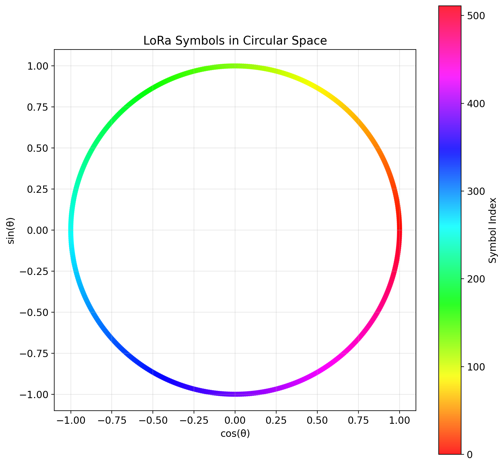
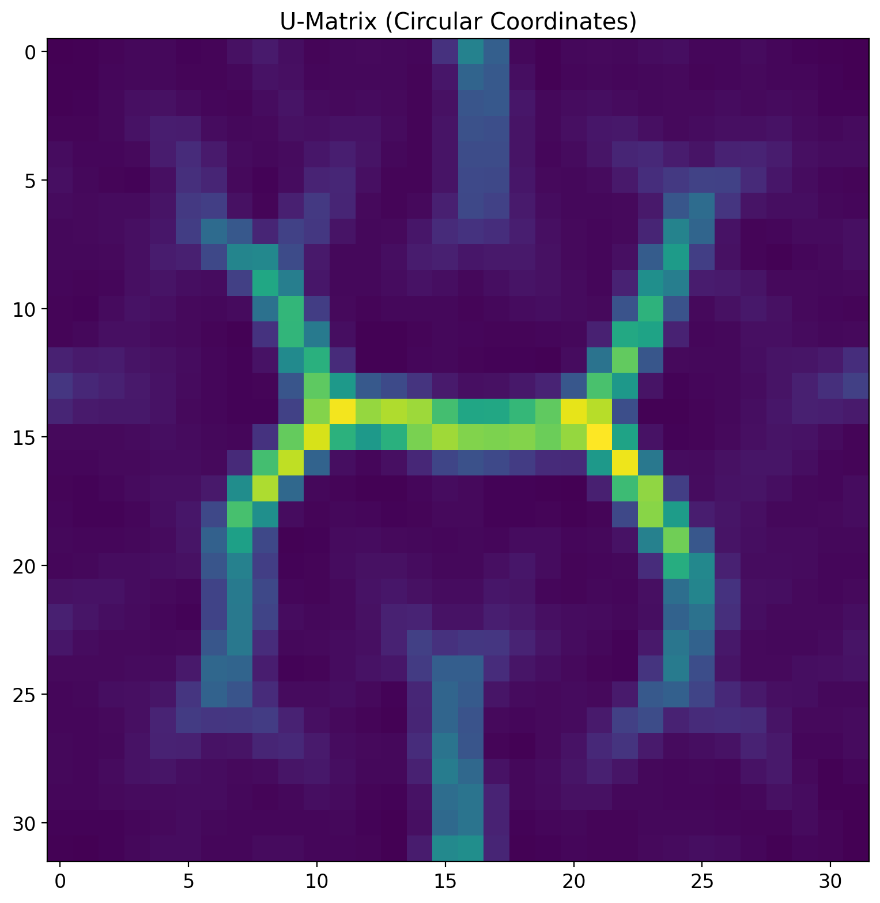
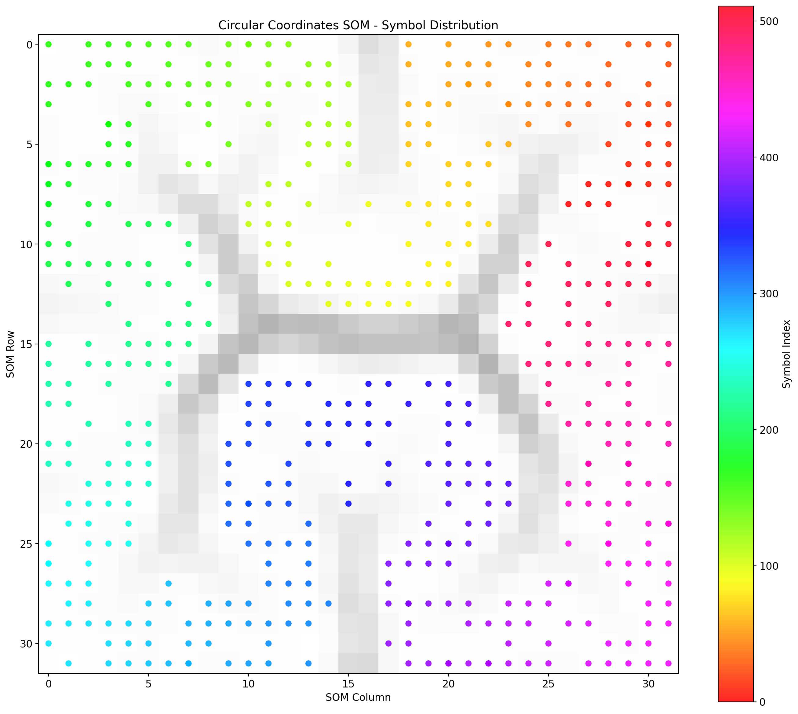
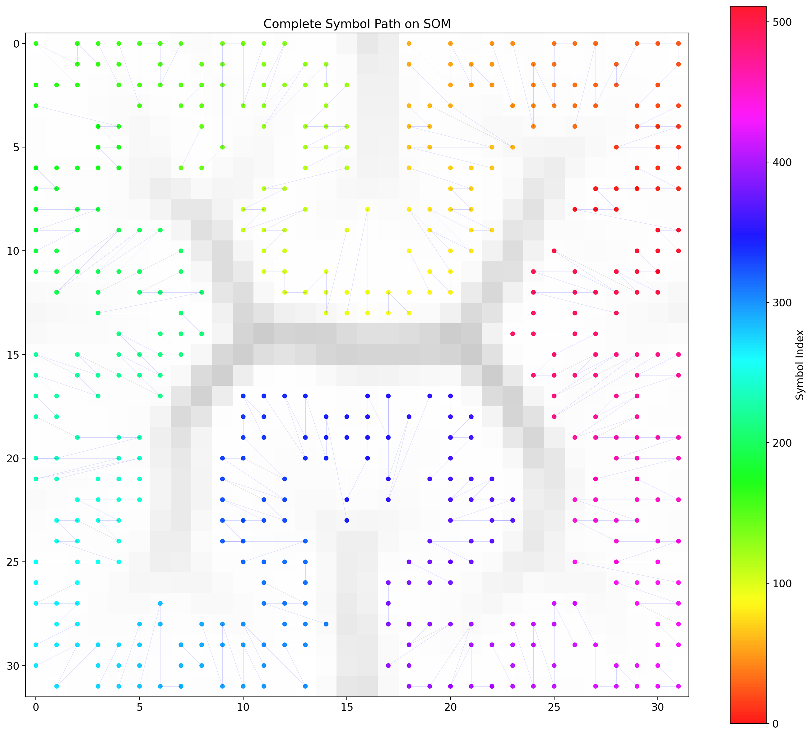

# LoRa Symbol Analysis with Self-Organizing Map (SOM)

LoRa(Chirp Spread Spectrum) 심볼을 **SOM(Self-Organizing Map)** 으로 시각화/분석하는 실험 모음입니다.

- 환경: SF=9, 심볼 512개, 기본적으로 노이즈 없는(Clean) 조건
- 목적: “심볼 간 유사도/거리”를 어떤 표현 공간에서 정의하느냐에 따라 SOM 토폴로지가 어떻게 달라지는지 확인

## 폴더 구조

- [model-test](model-test)
  - [lora_som_analysis.ipynb](model-test/lora_som_analysis.ipynb): Real+Imag vs FFT magnitude 표현 비교
  - [lora_som_circular.ipynb](model-test/lora_som_circular.ipynb): 심볼 인덱스를 원형 좌표로 임베딩해 “순환 거리”를 직접 반영
  - [lora_som_dechirp.ipynb](model-test/lora_som_dechirp.ipynb): dechirp/FFT 기반 확인 및 실험(노트북)
  - [som.py](model-test/som.py): SOM 구현
- [utils](utils)
  - [LoRa.py](utils/LoRa.py): LoRa 심볼 생성/처리 유틸
  - [my_lora_utils.py](utils/my_lora_utils.py): 보조 유틸

## 핵심 아이디어 (3가지 표현 공간)

### 1) 원형 좌표 공간 (Circular embedding)
- 입력: 심볼 인덱스 $k$를 $\theta=2\pi k/N$로 두고 $(\cos\theta, \sin\theta)$로 변환
- 거리: 2D 유클리드 거리(원 위 chord length) → 순환 거리 $d_\text{circ}=\min(|\Delta|, N-|\Delta|)$와 단조 대응
- 의미: “신호의 물리적 파형”이 아니라 **심볼 인덱스의 순환 구조**를 SOM에 직접 주입해 토폴로지 보존 여부를 점검

노트북: [lora_som_circular.ipynb](model-test/lora_som_circular.ipynb)

### 2) 시간영역 Real+Imag 공간 (I/Q 시계열 펼치기)
- 입력: 복소수 심볼을 [real, imag]로 이어붙인 고차원 벡터
- 거리: (정규화 후) 유클리드 거리
- 의미: “파형(I/Q) 유사도”를 직접 비교
- 주의: LoRa chirp는 심볼에 따라 위상/주파수 구조가 크게 변하므로, 인덱스 순서와 단순 유사도가 잘 맞지 않을 수 있음

노트북: [lora_som_analysis.ipynb](model-test/lora_som_analysis.ipynb)

### 3) 주파수영역 FFT magnitude 공간 (위상 제거)
- 입력: 각 심볼의 $|\mathrm{FFT}(x)|$ 벡터(위상 정보 제거)
- 거리: (정규화 후) 유클리드 거리
- 의미: 위상 변화에 둔감한 스펙트럼 형태 유사도 비교 → 실험에서 더 안정적으로 “질서(그라데이션)”가 나타나는 경향

노트북: [lora_som_analysis.ipynb](model-test/lora_som_analysis.ipynb)

## 실험 결과 요약 (현재 노트북 출력 기준)

## 결과 이미지

### Real+Imag vs FFT magnitude (비교)

### Circular embedding

### 비교: Real+Imag vs FFT magnitude
노트북: [lora_som_analysis.ipynb](model-test/lora_som_analysis.ipynb)

- Real+Imag SOM
  - Quantization Error: 26.9579
  - Topographic Error: 0.4609
- FFT Magnitude SOM
  - Quantization Error: 0.0026
  - Topographic Error: 0.0957

해석(요약): FFT magnitude는 위상 영향을 제거해서, SOM 관점에서 더 일관된 이웃 구조(낮은 TE)가 나타남.

### 원형 좌표(순환 구조 직접 주입)
노트북: [lora_som_circular.ipynb](model-test/lora_som_circular.ipynb)

- Dechirp 후 FFT 피크 인덱스가 심볼 인덱스와 일치함을 확인
- Circular embedding에서 $d(0,1)\approx d(0,511)$, $d(0,256)=2$ 등 순환 거리가 반영됨
- 출력 지표(노트북 기준)
  - Quantization Error: 0.003281
  - Topographic Error: 0.6152

해석(요약): 입력 공간 자체는 순환 구조를 정확히 갖지만, 2D 격자 SOM에서 “완전한 1D 링 토폴로지”가 항상 깔끔히 보존되진 않음(TE가 큼).

## 메모

- 시각화 산점도는 겹침을 줄이기 위해 jitter(작은 랜덤 오프셋)를 주는 경우가 있어, 정확한 BMU 좌표는 정수 격자임.
- 결과 재현을 위해 SOM의 `random_seed`를 고정하는 것을 권장.
